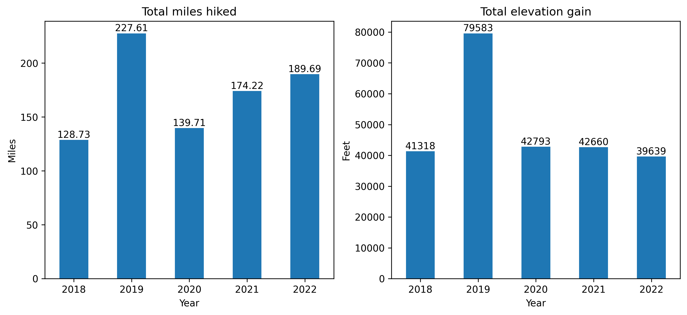
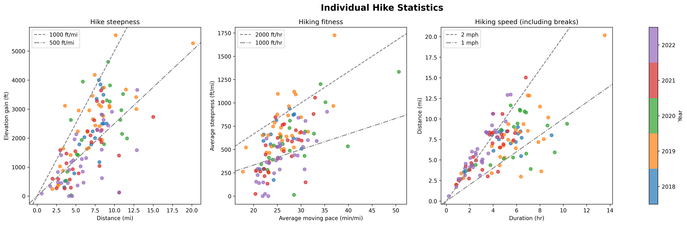

# hiking_analytics
Simple analytics of my hiking data.

## Usage
The `hiking_analytics.ipynb` Jupyter Notebook analyzes a CSV file of hiking activity data. The file may be manually created or downloaded from Strava, and should be stored in the same folder as the Notebook.

A manually created file needs to be a CSV file with the following columns:
- `date`: date of hike, e.g. as YYYY-MM-DD
- `average_moving_pace`: minutes per mile, i.e. as HH:MM:SS
- `total_duration`: total duration of hike, including breaks, i.e. as HH:MM:SS
- `distance_mi`: total distance of hike in miles
- `elevation_gain_ft`: total elevation gain in feet
- `max_elevation_ft`: maximum elevation in feet

To get a CSV of activity data from Strava, follow the Bulk Export instructions at [this link](https://support.strava.com/hc/en-us/articles/216918437-Exporting-your-Data-and-Bulk-Export) to download your full data archive. Once you have downloaded your data archive, the required file is 'activities.csv' in the data archive folder.

After you have created or downloaded your hiking data file, set the appropriate `filesource` and `filename` parameters in the first cell of the notebook, and run the script.

## Output
The notebook produces five plots, with examples shown below:
1. Total annual miles hiked and elevation gain
2. Cumulative annual miles hiked and elevation gain
3. Annual average/median hiking statistics (distance, elevation gain, max elevation, steepness, fitness, speed)
4. Annual distributions of hiking statistics
5. Statistics for individual hikes (steepness, fitness, speed), colored by year

